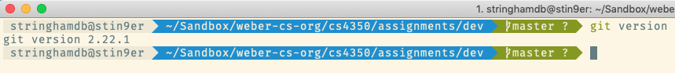
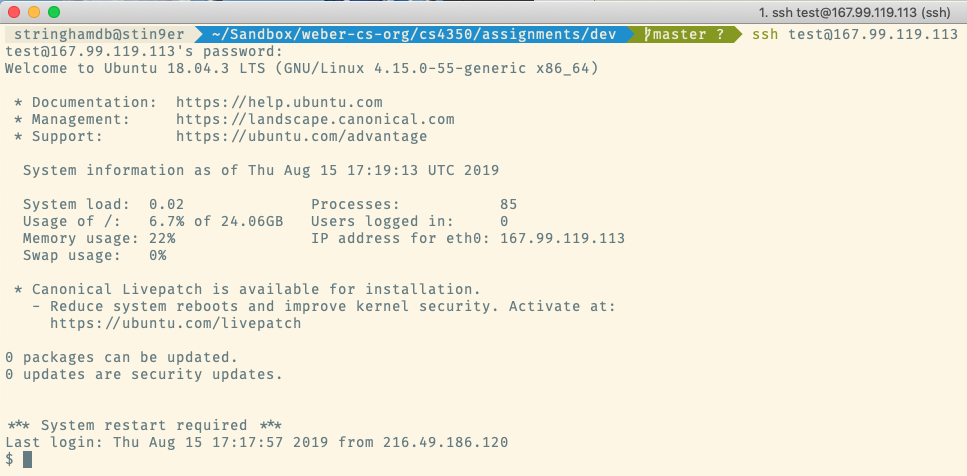
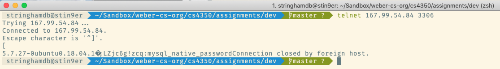

```
Development Environment Setup (Points **100**)
```

### 01 - PhpStorm by Jetbrains (***15***)

1. Goto [https://www.jetbrains.com/phpstorm/](https://www.jetbrains.com/phpstorm/). 
2. Download PhpStorm for your operating system.
3. Install PhpStorm.

### 02 - Git (***15***)

1. You will need [git](https://en.wikipedia.org/wiki/Git) on your laptop.
2. On Linux based systems such as Ubuntu, Debian, Darwin (MacOS), `git` should already be installed.
3. On Windows you'll have to follow instructions at [https://git-scm.com/downloads](https://git-scm.com/downloads).
4. Test `git` by issuing this command in the local console: `git version`.  If you see something like this  then `git` is working.
5. Type `exit` to return to your local console.

### 03 - GitHub (***15***)

1. You will need a [GitHub](https://github.com) account for this class.
2. If you do not already have one please sign up for one.
3. Send me your name, Weber username and github username to [donstringham@weber.edu](mailto:donstringham@weber.edu).

### 04 - SSH (***15***)

1. You will need [secure shell (ssh)](https://en.wikipedia.org/wiki/Secure_Shell) on your laptop.
2. On Linux based systems such as Ubuntu, Debian, Darwin (MacOS), `ssh` should already be installed.
3. On Windows you'll need to use tools such as [PuTTY](https://www.putty.org/) or [Cygwin](https://www.cygwin.com/).
4. Open a console on your laptop.
4. Test `ssh` by issuing this command in the local console: `ssh test@167.99.119.113`.  If you see this  then `ssh` is working.
5. Type `exit` to return to your local console.

### 05 - Telnet (***15***)

1. You will [telnet](https://en.wikipedia.org/wiki/Telnet) on your laptop for testing connections.
2. On Linux based systems such as Ubuntu, Debian, Darwin (MacOS), `telnet` should already be installed.
3. Open a console on your laptop.
4. Test `telnet` by issuing this command in the local console: `telnet 167.99.54.84 3306`
If you see this  then `telnet` is working.  Look for the string `5.7.27-0ubuntu0.18.84.1`.
5. Type `exit` to return to your local console.

### 06 - Learn Linux CLI Fundamentals (***25***)

1. If you don't have PluralSight credentials already, please contact [Ted Cowans](mailto:tedcowan@weber.edu) immediately.
2. Go to [https://www.pluralsight.com/courses/linux-cli-fundamentals](https://www.pluralsight.com/courses/linux-cli-fundamentals).
3. Turn in a screen-shot of the completion page of the course via [Canvas](https://weber.instructure.com/courses/485115).
